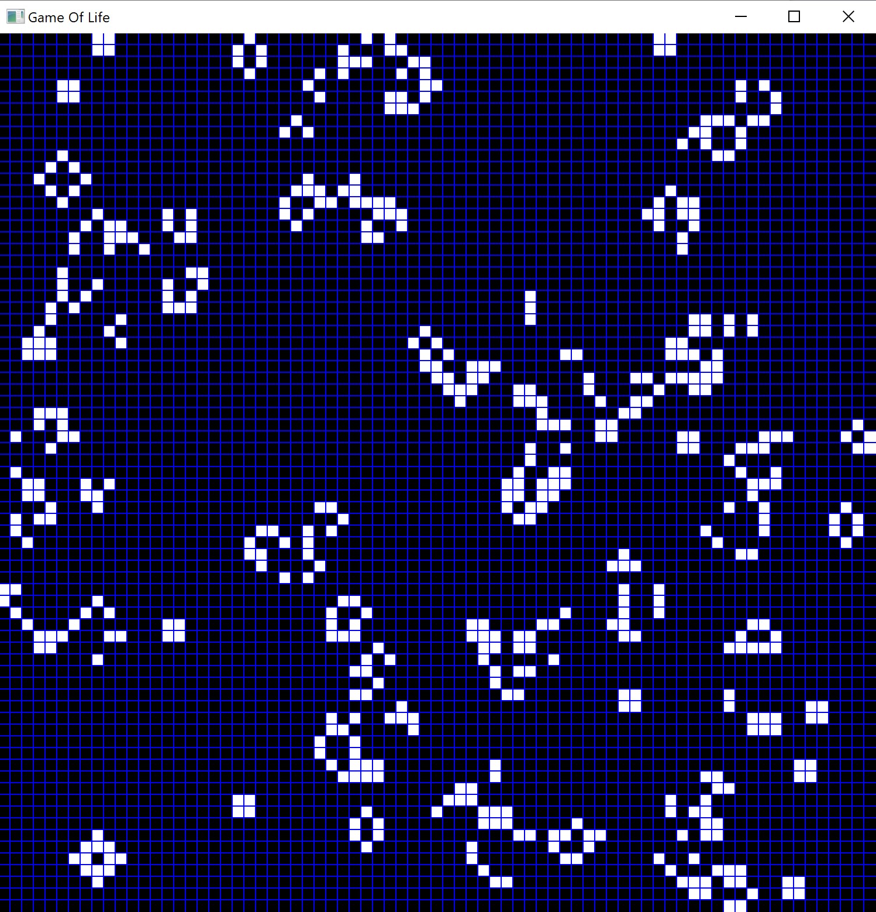

# Game Of Life
This is an object oriented implementation of Conway's Game Of Life in C++ using the multimedia library SFML.

## Screenshot

## Use the following instructions to run the program
Copy the <a href="https://www.sfml-dev.org/download/sfml/2.5.1/" target="_blank">sfml-library folder</a> (named as "sfml") into the same directory where the GameOfLife.sln document is located. The other .dll files (sfml-graphics-d-2.dll, sfml-window-d-2.dll, ...) have to be copied into the "Debug" folder. So the finally folder structure is like the following:
<pre>
<code>Project Folder
│   .gitignore
│   README.md
│
├───GameOfLife
│   │   [*.cpp, *.h]
│   │   GameOfLife.sln
│   │   main.cpp
│   │   [...]
│   │
│   ├───Debug
│   │       GameOfLife.exe
│   │       sfml-audio-d-2.dll
│   │       sfml-graphics-d-2.dll
│   │       sfml-network-d-2.dll
│   │       sfml-system-d-2.dll
│   │       sfml-window-d-2.dll
│   │       [...]
│   │
│   └───sfml
│       ├───bin
│       │       sfml-audio-2.dll
│       │       sfml-audio-d-2.dll
│       │       sfml-graphics-2.dll
│       │       [...]
│       │
│       ├───include
│       │   └───SFML
│       │       │   Audio.hpp
│       │       │   Config.hpp
│       │       │   Graphics.hpp
│       │       │   [...]
│       │       │
│       │       ├───Audio
│       │       │       [...]
│       │       │
│       │       ├───Graphics
│       │       │       [...]
│       │       │
│       │       ├───Network
│       │       │       [...]
│       │       │
│       │       ├───System
│       │       │       [...]
│       │       │
│       │       └───Window
│       │               [...]
│       │
│       └───lib
│           │   sfml-graphics-d.lib
│           │   sfml-graphics-d.pdb
│           │   sfml-graphics-s-d.lib
│           │   [...]
│           │
│           └───cmake
│               └───SFML
│                       SFMLConfig.cmake
│                       [...]
│
└───res
        [...]

</code>
</pre>
